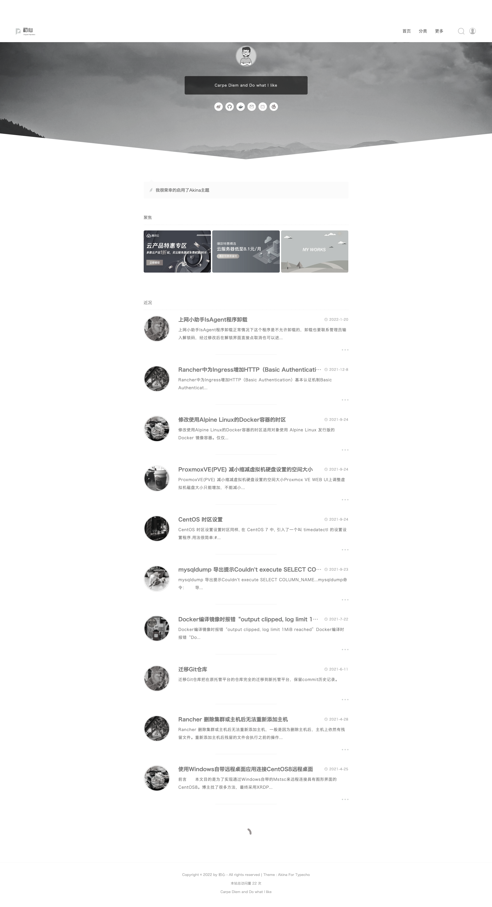

# 开启追悼模式

开启追悼模式后，网站变灰

### 使用方法

1. 下载本插件，放在 usr/plugins/ 目录中
2. 登录管理后台，激活插件
3. 开启追悼模式

### Links

- Blog：https://mayanpeng.cn
- Email: pony#ponycool.com(将#替换为@)
- Github: https://github.com/PonyCool
